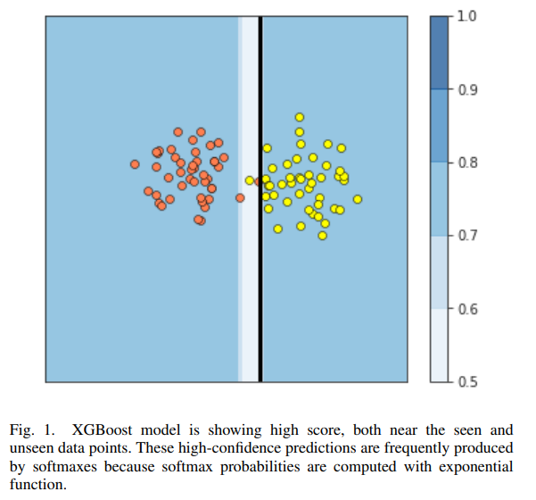
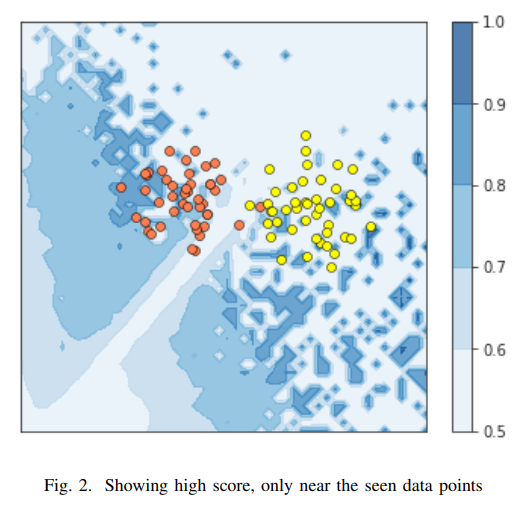

# 🔍 Uncertainty Estimation in Machine Learning

## 📌 Overview

In many real-world machine learning applications, models not only need to make accurate predictions but also estimate **how confident they are** in those predictions.

Traditional models like Neural Networks and Gradient Boosting often produce **overconfident predictions**, even on unfamiliar or out-of-distribution data. This can lead to **risky decisions**, especially in domains like finance, healthcare, and risk modeling.

This project focuses on **estimating predictive uncertainty** and using it to make more reliable decisions.

---

## 🎯 Objectives

* Quantify **model uncertainty** in predictions
* Detect **out-of-distribution (OOD)** data
* Improve decision-making using uncertainty scores
* Compare multiple uncertainty estimation techniques

---

## ⚙️ Techniques Implemented

This project implements and compares multiple approaches:

* 🔹 **Monte Carlo Dropout (MCD)**
* 🔹 **Deep Ensembles**
* 🔹 **Multiple XGBoost Models (MultiXGB)**
* 🔹 **Randomized XGBoost (RandomXGB)**

---

## 🧠 Key Idea

Instead of relying only on predictions:

👉 We also measure **uncertainty of predictions**

This helps in:

* Identifying unreliable predictions
* Handling unseen data
* Making safer decisions in high-risk scenarios

---

## 📂 Project Structure

```
uncertainty-estimation-machine-learning/
│
├── images/                         # Visualizations for model behavior
│   ├── overconfident.png           # Overconfident predictions on unseen data
│   └── uncertainty_aware.png       # Uncertainty-aware model behavior
│
├── preprocessing/                  # Data preprocessing pipeline
│   ├── preprocessing.py
│   ├── pp_runner.py
│   └── preprocessing.json
│
├── training/                       # Model training logic
│   ├── train_bin.py
│   ├── train_multi.py
│   ├── train_rgr.py
│   ├── generator.py
│   ├── training_strategy_de.json
│   ├── training_strategy_mc.json
│   ├── training_strategy_xgb.json
│   └── training_strategy_xgbRndm.json
│
├── testing/                        # Model testing scripts
│   ├── test_bin.py
│   ├── test_multi.py
│   └── test_rgr.py
│
├── autotuning/                     # Hyperparameter tuning strategies
│   ├── deep_en_rgr.py
│   ├── mc_dropout.py
│   ├── mc_dropout_multi.py
│   ├── mc_dropout_rgr.py
│   └── training_strategy.json
│
├── experiment/                     # Experimental setups & datasets
│   ├── multipleXGB.py
│   ├── randomXGB.py
│   └── UCI_Datasets/               # Benchmark datasets for evaluation
│
├── data/                           # Training & evaluation datasets
│   ├── boston/
│   ├── breast_cancer/
│   ├── loan/
│   └── mnist/
│
├── process_data.py                 # Data preprocessing entry point
├── train_data.py                   # Main training script
├── test_data.py                    # Testing entry point
├── Evaluation.py                   # Model evaluation
├── Predict.py                      # Prediction script
├── findCutoff.py                   # Threshold optimization
│
├── param.json                      # Model configuration
├── dependencies.txt                # Required libraries
└── README.md
```

---

## ⚡ Installation

Clone the repository:

```
git clone https://github.com/codexankit/uncertainty-estimation-machine-learning.git
cd uncertainty-estimation-machine-learning
```

Install dependencies:

```
pip install -r dependencies.txt
```

---

## 🛠️ Usage

### 1️⃣ Preprocessing

```
python process_data.py --dataPath DATA_PATH --dataSaveDir OUTPUT_PATH
```

---

### 2️⃣ Training

```
python train_data.py --algo MCD -dr DATA_PATH -tc TARGET_COLUMN
```

Available algorithms:

* `MCD`
* `DeepEnsmb`
* `MultiXGB`
* `RandomXGB`

---

### 3️⃣ Evaluation

```
python Evaluation.py --algo MCD -edr DATA_PATH -esd OUTPUT_PATH
```

---

### 4️⃣ Prediction

```
python Predict.py --algo MCD -pdr DATA_PATH -psd OUTPUT_PATH
```

---

## 📊 Dataset

This project is tested on the **Lending Club Loan Dataset**, which includes:

* Loan status (Fully Paid, Charged Off, etc.)
* Borrower financial details
* Payment history

We define:

* ✅ **Good Loan** → Positive profit
* ❌ **Bad Loan** → Negative profit

We also analyze:

* Out-of-distribution data (e.g., COVID-19 period shifts)
* High-risk segments (e.g., low FICO scores)

---

## 📈 Results & Insights

* Uncertainty estimation helps detect **high-risk predictions**
* Ensemble methods improve **confidence calibration**
* Models can identify **out-of-distribution samples**
* Useful in **risk-sensitive domains like finance**

  ## 📊 Visualizing Model Confidence vs Uncertainty

### 🔹 Overconfident Predictions (Problem)

<p align="center">
  
</p>
Traditional models like XGBoost often assign **high confidence scores even to unseen or out-of-distribution data**.
This happens due to the nature of softmax probabilities, which can produce extreme values even for unfamiliar inputs.

👉 This leads to **dangerous overconfidence**, especially in critical applications.

---

### 🔹 Uncertainty-aware Predictions (Solution)

<p align="center">
  
</p>
In contrast, uncertainty-aware models assign **high confidence only near known data regions** and lower confidence elsewhere.

👉 This allows the model to:

* Detect unfamiliar inputs
* Avoid unreliable predictions
* Improve decision-making

---

### 🔹 Performance Comparison

<h3 align="center">💰 Profit Scores Across Certain vs Uncertain Data</h3>

<table align="center" border="1" cellpadding="8" cellspacing="0">
  <tr>
    <th>Benchmark</th>
    <th>2018Q1 (Certain)</th>
    <th>2019Q4 (Certain)</th>
    <th>2020Q1 (Uncertain)</th>
    <th>FICO &lt; 500 (Uncertain)</th>
  </tr>

  <tr>
    <td><b>Maximal</b></td>
    <td>100</td>
    <td>100</td>
    <td>100</td>
    <td>100</td>
  </tr>

  <tr>
    <td><b>XGBoost</b></td>
    <td>96</td>
    <td>46</td>
    <td style="color:red;"><b>-11</b></td>
    <td style="color:red;"><b>-41</b></td>
  </tr>

  <tr>
    <td><b>MC Dropout</b></td>
    <td>94</td>
    <td>87</td>
    <td style="color:green;"><b>75</b></td>
    <td style="color:green;"><b>10</b></td>
  </tr>

  <tr>
    <td><b>Deep Ensemble</b></td>
    <td>93</td>
    <td>94</td>
    <td style="color:green;"><b>63</b></td>
    <td style="color:green;"><b>6.7</b></td>
  </tr>
</table>
<h3 align="center">📊 Model Performance on Uncertain Data Segments</h3>

<table align="center" border="1" cellpadding="8" cellspacing="0">
  <tr>
    <th rowspan="2">Models</th>
    <th colspan="3">Performance (2020Q1 - Uncertain)</th>
    <th colspan="3">Performance (FICO &lt; 500)</th>
    <th rowspan="2">Uncertainty Threshold</th>
  </tr>
  <tr>
    <th>Profit Score</th>
    <th>AUC</th>
    <th>% Uncertain</th>
    <th>Profit Score</th>
    <th>AUC</th>
    <th>% Uncertain</th>
  </tr>

  <tr>
    <td style="background-color:#FFD966;"><b>XGBoost</b></td>
    <td>-11</td>
    <td>60.2</td>
    <td>-</td>
    <td>-41</td>
    <td>81.3</td>
    <td>-</td>
    <td>-</td>
  </tr>

  <tr>
    <td style="background-color:#FFD966;"><b>Deep Ensemble</b></td>
    <td>63.8</td>
    <td>77.2</td>
    <td>12.6</td>
    <td>0.98</td>
    <td>91.9</td>
    <td>20.5</td>
    <td>0.03</td>
  </tr>

  <tr>
    <td style="background-color:#FFD966;"><b>MC Dropout</b></td>
    <td>43.2</td>
    <td>68.4</td>
    <td>25.1</td>
    <td>1.2</td>
    <td>83.8</td>
    <td>24.8</td>
    <td>0.004</td>
  </tr>

  <tr>
    <td style="background-color:#FFD966;"><b>Multi XGB</b></td>
    <td>75.2</td>
    <td>81.1</td>
    <td>19.6</td>
    <td>6.5</td>
    <td>86.5</td>
    <td>13.7</td>
    <td>0.005</td>
  </tr>

  <tr>
    <td style="background-color:#FFD966;"><b>Random XGB</b></td>
    <td>48.5</td>
    <td>72.3</td>
    <td>17.4</td>
    <td>0.9</td>
    <td>79.3</td>
    <td>11.2</td>
    <td>220**</td>
  </tr>
</table>


The table shows performance across different models on **uncertain data segments**.

**Key Insights:**
- Traditional XGBoost performs poorly on uncertain data (negative profit scores)
- Uncertainty-aware models significantly improve performance
- MultiXGB achieves the best balance between profit and uncertainty handling
- Filtering uncertain predictions improves decision-making in risk-sensitive scenarios

👉 This demonstrates the **real-world value of uncertainty estimation**, especially in financial risk scenarios.


---

## 🚀 Future Improvements

* Improve scalability for large datasets
* Add more advanced Bayesian methods
* Integrate real-time prediction pipeline
* Add visualization dashboard

